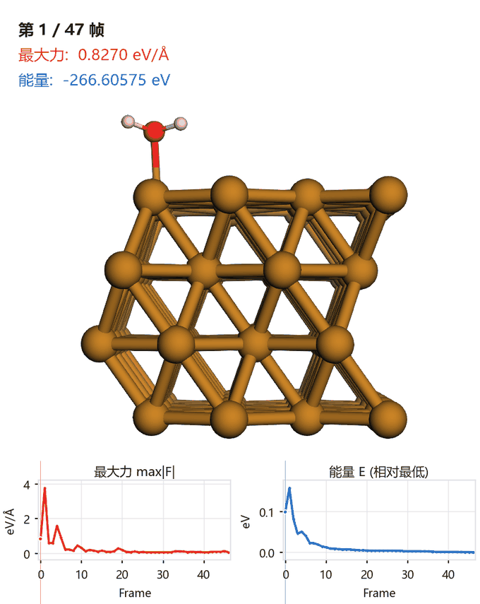
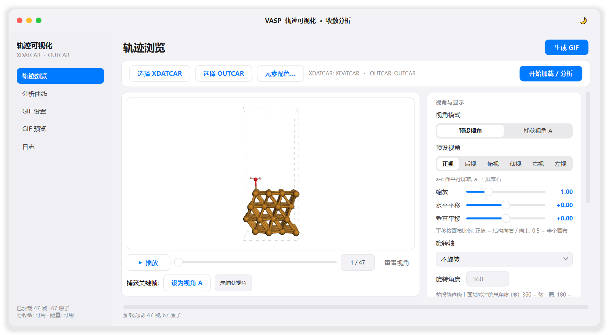
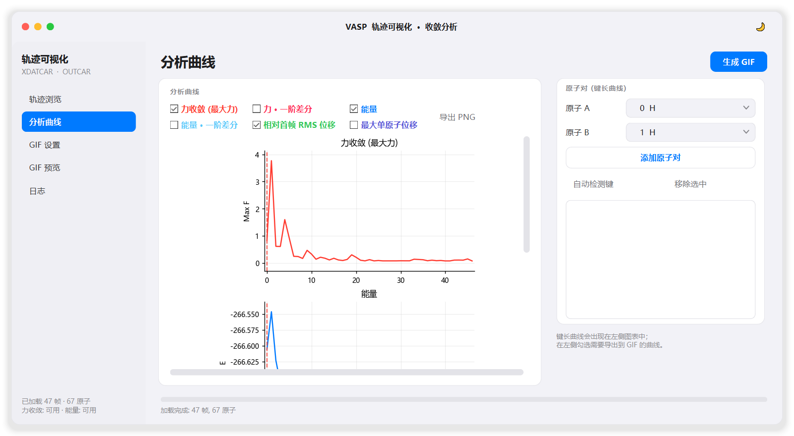
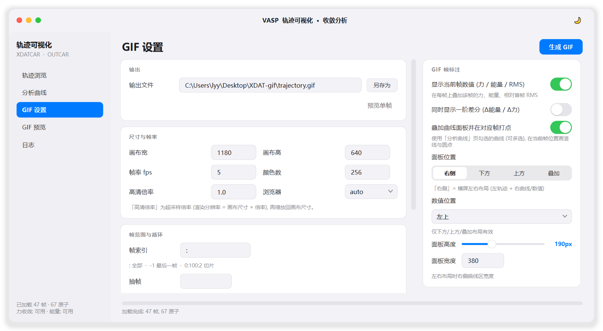

<div align="center">

# VASP 轨迹可视化 & 收敛分析工作台

**把 VASP 的 XDATCAR 轨迹与 OUTCAR 能量/力，变成可交互的 3D 动画、清晰的收敛曲线，以及可直接放进汇报的 GIF。**

[](https://www.python.org/)
[](https://doc.qt.io/qtforpython/)
[](https://3dmol.csb.pitt.edu/)
[](#)
[](LICENSE)
[](https://github.com/moyulyy/XDAT-gif/releases/latest)

[📥 下载便携版](https://github.com/moyulyy/XDAT-gif/releases/latest) ·
[功能一览](#功能一览) ·
[快速开始](#快速开始) ·
[界面预览](#界面预览) ·
[打包成 exe](#打包便携版文件夹推荐)

</div>

---

<div align="center">



*示例：`samples/` 中 Cu(100) 表面吸附 H₂O 的弛豫轨迹 —— 相机绕竖直轴旋转一周，
每帧同步叠加「最大力 / 能量」数值，底部曲线实时打点。*

</div>

---

## 功能一览

| 模块 | 能力 |
|------|------|
| 🧬 **轨迹浏览** | 内嵌 **3Dmol.js** 交互式 3D 窗口（WebGL），拖动旋转 / 滚轮缩放 / 逐帧播放，先「看」再出图 |
| 📈 **收敛分析** | 从 OUTCAR 解析**力收敛 / 能量**（等价于 `dev/cgv.sh`），外加键长 / RMS 位移 / 一阶差分等曲线 |
| 🎥 **GIF 导出** | 当前相机视角一键出图，可按**晶胞 a/b/c 轴或屏幕方向**匀速旋转；逐帧叠加数值 + 曲线打点 |
| 🎨 **元素配色** | 完整周期表（118 种元素）逐元素改颜色与 ball 直径，默认 VESTA 经典配色 |
| 🖥️ **原生桌面** | PySide6（Qt 6）打造，iOS / macOS 风格界面，可打包成**免安装便携版**（零解包、启动快） |

> 所有曲线勾选后**同时**用于分析页显示与 GIF 曲线面板叠加，所见即所得。

---

## 界面预览

<div align="center">

### 轨迹浏览


### 分析曲线 · 力 / 能量收敛


### GIF 设置 · 尺寸 / 帧率 / 标注


</div>

---

## 目录结构

```text
XDAT-gif/
├─ xdatcar_gif_gui.py        # ★ 图形界面主程序 (PySide6, iOS 风格)
├─ xdatcar_to_gif_3dmol.py   # ★ 3Dmol.js 渲染核心 (Playwright 逐帧截图 + GIF 合成)
├─ vasp_parser.py            # ★ XDATCAR/OUTCAR 解析与分析 (cgv.sh 的 Python 实现)
├─ gif_overlay.py            # ★ GIF 帧标注 (数值文本 + 曲线底板)
├─ trajectory_viewer.py      # ★ 内嵌交互式 3D 轨迹浏览器 (QWebEngineView)
├─ analysis_view.py          # ★ matplotlib 分析曲线 (固定子图 + 滚动, 跟随当前帧)
├─ ui_kit.py                 # ★ iOS 风格 Qt 控件 (卡片/开关/分段控件/滑块/提示)
├─ 3dmol/3Dmol-min.js        # ★ 本地 3Dmol.js (离线可用)
├─ assets/app.ico            # ★ 应用图标
├─ docs/                     # README 动图与界面截图
├─ VASP_Trajectory.spec      # PyInstaller 打包配置
├─ build_exe.bat             # 双击即可打包成便携版文件夹 (可选单文件)
├─ run_gui.bat               # 双击用源码启动 GUI (无控制台)
├─ run_gui_debug.bat         # 同上, 但保留控制台便于看报错
├─ samples/                  # 演示数据 (Cu(100)+H2O, 47 帧) —— README 动图即由它生成
├─ test/                     # 自检用数据 (180 原子 / 166 帧)
└─ dev/                      # 开发辅助, 与运行无关
   ├─ cgv.sh                 #   力/能量收敛逻辑的原始 shell 参考实现
   ├─ make_readme_gif.py     #   生成 docs/demo.gif (换样例后重跑即可更新 README 动图)
   ├─ screenshot_gui.py      #   生成 docs/gui_*.png 界面截图
   ├─ make_icon.py           #   生成 assets/app.ico
   ├─ view_xdatcar.py        #   早期独立查看脚本 (已被 GUI 取代)
   └─ audit_dlls.py          #   打包后审计 DLL 是否误取自 base conda

★ = 运行所需, 打包时会被收进 exe; dev/ 与 samples/ 不参与打包。
```

---

## 环境要求

- Python 环境：`D:\miniconda3\envs\chem_env\python.exe`（任意 3.10+ 环境亦可）
- Python 包：`ase`、`numpy`、`pillow`、`matplotlib`、`playwright`、`PySide6`
- 浏览器：本机已安装 **Edge** 或 **Chrome**（Playwright 通过 `channel` 调用）；
  若都没有，可执行 `python -m playwright install chromium`

```bat
D:\miniconda3\envs\chem_env\python.exe -m pip install ase numpy pillow matplotlib playwright PySide6
```

---

## 快速开始

### 方式一：下载便携版（无需 Python）

到 [**Releases**](https://github.com/moyulyy/XDAT-gif/releases/latest) 下载
`VASP轨迹可视化_便携版_v1.0.0.zip`，解压后双击：

```text
VASP轨迹可视化\VASP轨迹可视化.exe
```

### 方式二：双击 bat 用源码启动

双击 **`run_gui.bat`**（无控制台）或 **`run_gui_debug.bat`**（保留控制台）。

### 方式三：命令行

```bat
D:\miniconda3\envs\chem_env\python.exe xdatcar_gif_gui.py
```

### 方式四：命令行渲染（不打开界面）

```bat
D:\miniconda3\envs\chem_env\python.exe xdatcar_to_gif_3dmol.py ^
    --view right --zoom 1.45 --radius-scale 0.45 -w 500 --height 750 --fps 20 -o trajectory.gif
```

---

## 使用流程（推荐）

1. **轨迹浏览**页
   - 顶部一排按钮：**选择 XDATCAR** / **选择 OUTCAR** / **元素配色…** / **开始加载 / 分析**
     （没有输入框；选 XDATCAR 时会自动识别同目录的 OUTCAR）。
   - 下方是**尽量放大**的 3D 窗口：拖动旋转、滚轮缩放、播放/暂停、拖动进度条逐帧查看。
   - 找到满意角度点 **「设为视角 A」**，右栏「视角模式」选 **捕获视角 A** 即可用它。
   - 想要镜头转动：在 **旋转轴** 里选 a/b/c 轴（或屏幕竖直/水平），再填 **旋转角度**
     （360 = 水平转一圈，正视图 + 绕 c 轴最常用）。
   - 右侧参数栏（常驻，可直接滚动）里调视角模式、预设视角、
     缩放、旋转轴、旋转角度、原子风格、半径缩放、统一半径、晶胞、背景色，并点「应用到 3D」。
2. **分析曲线**页
   - 右侧参数栏选两个原子 → 「添加原子对」/「自动检测键」得到**键长曲线**。
   - 勾选曲线：力收敛 / 力一阶差分 / 能量 / 能量一阶差分 / RMS / 最大单原子位移。
     每个子图**尺寸固定**（不使用会互相遮挡的紧凑布局）；用 matplotlib
     `constrained` 布局引擎自动排布标题/轴标签，已用 tightbbox 验证两两无重叠；
     勾选越多向下滚动查看，不会越画越小。
   - 数值是否正确可对照上一节：`max_force` 就是 cgv.sh 的 `force.conv`。
3. **GIF 设置**页：输出、尺寸/**帧率（默认 5）**/**颜色数（默认 256）**/高清倍率、帧范围、
   乒乓循环、**循环播放**、标注方式；另有「预览单帧」。
   想要更清晰 → 调大画布尺寸 + 高清倍率填 2（详见「清晰度：三个旋钮」）。
   - **默认不抽帧**：「帧索引」为 `:`、「抽帧」与「最多帧数」留空，
     即使用 XDATCAR 的**全部帧**；卡片右侧会实时显示
     「将渲染 N 帧 / 共 M 帧 · 不抽帧」，改了参数立刻变。
   - 「抽帧」填 N = 隔 N 帧取 1 帧；「最多帧数」填 N = 只渲染前 N 帧。
4. 点右上角 **「生成 GIF」**，会弹出**进度弹窗**（进度条 + 状态 + 取消）。

> 分析曲线中勾选的曲线，会**同时**用于 GIF 的曲线面板叠加，所见即所得。

---

## 元素配色（完整周期表）

- 点 **「元素配色…」** 弹出**完整周期表**（118 种元素）。
- 点击任一元素即可修改：
  - **颜色**（点击色块打开取色器）
  - **ball 直径**（单位 Å，直接控制该元素球的直径）
- 当前结构中的元素以**蓝色描边**标出；选中元素以橙色描边。
- 默认使用**内置 VESTA 经典配色**（H 浅粉、C 棕、O 红、Co 蓝、Ni 浅灰…），
  无需任何 `.vesta` 文件；「该元素默认 / 恢复全部默认」一键还原。
- 修改同时作用于 3D 交互窗口与最终 GIF。
- 半径的优先级：**统一半径（填写时） > 元素自定义直径 > VESTA 半径 × 半径缩放**。
  命令行 `xdatcar_to_gif_3dmol.py` 仍保留 `--vesta FILE` 读取外部文件的能力。

---

## 六个标准视角（基于晶胞矢量，不是写死的欧拉角）

预设视角会根据**实际晶胞矢量**计算相机四元数，因此对三斜/单斜晶胞也严格正确。
屏幕坐标 = `R(q)·(原子坐标 − center)`，所以只需让旋转矩阵的三行为 `ex/ey/ez`：

| 视角 | 平行屏幕的面 | 屏幕 +x | 屏幕 +y | 说明 |
|------|--------------|---------|---------|------|
| 正视图 | a-c 面 | **a** | **c** | 你说的那个（看 b 方向） |
| 后视图 | a-c 面 | −a | c | |
| 俯视图 | a-b 面 | **a** | **b** | 看 c 方向 |
| 仰视图 | a-b 面 | −a | b | |
| 右视图 | b-c 面 | **b** | **c** | 看 a 方向 |
| 左视图 | b-c 面 | −b | c | |

实现要点：

- `view_quaternion(cell, name)` —— 把 `ey` 对 `ex` 做 Gram-Schmidt 正交化，
  再用 `ez = ex × ey` 补成右手系，最后用标准 Shepperd 公式转四元数。
- HTML 里新增 `window.setOrientation(q)`：**只改朝向、保留 center/zoom**
  （取景由 `fit_sphere()` + `ZOOM` 决定，见下）。
- 切换预设视角时**立即生效**，不需要再点“应用到 3D 窗口”。
- 已用 Playwright 打开真实 3Dmol 渲染器，回读 `getView()` 验证六个视角的
  a/b/c 屏幕分量与上表完全一致。

> 旧版是用 `viewer.rotate()` 叠加写死的欧拉角（如 `0x,-90y,-90x,0z`），
> 既不知道晶胞方向、顺序又易错，所以正视图是错的。已整体弃用。

---

## 分析曲线（cgv.sh → Python）

`vasp_parser.py` 把 `dev/cgv.sh` 的 shell/awk 逻辑完整翻译成 Python：

| dev/cgv.sh | vasp_parser.py |
|--------|----------------|
| `awk '/E0/' OSZICAR`，`plot u 1:5`（能量） | `parse_oszicar()`：优先读 **OSZICAR 的 E0**（与 cgv.sh 完全一致）；无 OSZICAR 时回退 OUTCAR 的 `free energy TOTEN` |
| `awk '/POSITION/,/drift/' OUTCAR`（力） | `parse_outcar()`：逐块读 `POSITION TOTAL-FORCE` 的后 3 列（OUTCAR 中该行正好 6 列，$4/$5/$6 就是力） |
| `if($4=="F") x=0; ...` **逐分量**把固定方向力置零 | `read_selective_flags()` 返回 **(N,3)** 掩码 + `parse_outcar()` 逐分量相乘 |
| `force=sqrt(x²+y²+z²)` 取每步最大 | `_fill_force_stats()` → `max_force`（即 cgv.sh 的 `force.conv`） |
| `delta = y[i]-y[i-1]` | `first_difference()`（首帧为 `NaN`） |

> 注：`cgv.sh` 的固定原子处理是**逐方向**的（例如 `T F F` 只保留 x 方向力），
> 早期版本误做成“整原子置零”，现已按 `(N,3)` 掩码逐分量处理。

**验证方式**：在 Python 里逐字重实现 cgv.sh 的 awk/
`paste` 流程（包括 `temp.f` / `temp.fixx` 对齐、逐分量置零、取最大），
与 `parse_outcar()` 的输出逐点比较：

- 无选择性动力学（`test/` 数据，166 步）：逐点最大误差 **0.0**
- 构造 `T F F` 掩码（每 3 个原子固定 y/z）：逐点最大误差 **0.0**

轨迹类曲线：

- **键长**：`bond_length_series()`，支持周期性最小镜像（MIC）
- **RMS 位移**：`rms_displacement_series()`
  `RMS_k = sqrt( mean_i |r_i^k − r_i^ref|² )`，默认参考首帧，MIC 避免跨边界跳变
- **最大单原子位移**：`max_atom_displacement_series()`

---

## GIF 帧标注的四种布局

在 **GIF 设置 → GIF 帧标注** 中组合开关即可。默认是 **左右布局（横屏）**：

| 位置 | 效果 |
|------|------|
| **右侧 (横屏)** ← 默认 | **左边轨迹 + 右边（上）数值 +（下）曲线**；输出宽高由「画布宽/高」决定，请保持 **宽 > 高**（如 1180 × 640）。「面板宽度」控制右侧曲线区宽 |
| 下方 | 轨迹在上、曲线横排在下 |
| 上方 | 曲线在上、轨迹在下 |
| 叠加 | 曲线缩小后贴在轨迹右下角 |

右侧布局的实现：

- 轨迹只按 `画布宽 − 面板宽度` 渲染（`args.render_width`），
  标注时再把「轨迹 + 右侧列」拼成完整画布，因此**输出尺寸精确等于你设的画布尺寸**。
- 右侧列：顶部是数值块（自动按面板宽度缩放字体，过长会自动缩号），
  下面是曲线底板（`max_cols=1`，竖直排列），与轨迹之间画 1px 分隔线。
- 曲线底板同样用 matplotlib `constrained` 布局，标题/轴标签不会互相遮挡。
- 选“右侧”时，画布自动调成横屏，且“数值位置 / 面板高度”会自动置灰（它们只在上下/叠加布局下有意义）。
- 面板宽度受限：会保证轨迹区宽度 **≥ 0.75 × 画布高**（至少 240px），否则
  轨迹区变得又窄又高、模型会被水平裁切（例如 800×640 时面板自动从 380 收到 320）。

其他可设：数值位置（四角）、面板高度、是否同时显示一阶差分（Δ能量 / Δ力）。

实现方式：曲线用 matplotlib **一次性**渲染成底板并记录每个数据点的像素坐标，
逐帧只在透明图层上画竖线与圆点再合成，因此**速度不受曲线数量影响**。

---

## 视角与旋转

- 3D 窗口相机朝向通过 3Dmol 的 `getView()` 读取：8 元组
  `[cx, cy, cz, zoom, qx, qy, qz, qw]`。
- **视角模式**（右栏「视角与显示」）：
  - **预设视角**：正视 / 后视 / 俯视 / 仰视 / 右视 / 左视（由晶胞矢量算出，与晶胞无关地稳定）。
  - **捕获视角 A**：在 3D 窗口拖到满意角度后点「设为视角 A」，GIF 就用这个方向。
- **旋转轴 / 旋转角度**：在基准视角上再绕指定轴匀速转一段，完全自己控制：

  | 旋转轴 | 含义 |
  |--------|------|
  | 不旋转 | 默认，固定不动 |
  | a 轴 / b 轴 / c 轴 | **晶胞矢量**方向（最常用：正视 + 绕 c 轴 360° = 水平转一圈）|
  | 屏幕竖直 / 屏幕水平 | 当前视图的竖直 / 水平方向（基准视角变了它跟着变） |

  旋转发生在**模型自身坐标系**里：`R(i) = R_基准 · R_轴(角度_i)`，
  角度从 0 线性走到你填的总角度。所以填 360 首尾同向、可无缝循环，
  180 就是转到反面。
- **取景与交互窗口严格一致**：GIF 只用朝向四元数，相机中心/缩放每帧都用
  `zoomTo() + zoom(缩放滑杆)` 重新计算。因为 3Dmol 的 `zoomTo/zoom` 只取决于
  相机 fov 与模型包围球（与画布尺寸、屏幕 DPI 无关），
  所以 GIF 的取景与「轨迹浏览」页看到的完全一致。

示例：**基准 = 正视图，旋转轴 = c 轴，角度 = 360** → c 轴全程严格竖直，
模型水平转一圈：

```text
 t=0.00  c轴->[+0.00 +1.00 +0.00]  a轴->[+1.00 0.00 0.00]
 t=0.25  c轴->[+0.00 +1.00 +0.00]  a轴->[ 0.00 0.00 -1.00]   ← a 正对镜头
 t=0.50  c轴->[+0.00 +1.00 +0.00]  a轴->[-1.00 0.00 0.00]
 t=0.75  c轴->[+0.00 +1.00 +0.00]  a轴->[ 0.00 0.00 +1.00]
 t=1.00  c轴->[+0.00 +1.00 +0.00]  a轴->[+1.00 0.00 0.00]
```

命令行同样可用：`--rot-axis c --rot-angle 360`。

  > 早期版本的坑（已修）：
  > 1. 直接把捕获的绝对 zoom 搬到另一尺寸的画布上 → 取景偏大/偏心；
  > 2. 额外调用 `zoomByFactor(设备像素比)` 补偿 → 模型放大 2 倍被裁切；
  > 3. `viewer.zoom(f, 1)` 内部是 `setTimeout(20ms)` 延迟动画，会和紧随其后的
  >    `setView()` 叠加一次缩放 → 首帧偏大。现统一用 `zoom(f, 0)` 同步生效；
  > 4. 3Dmol 的 `zoomTo()` 只以**原子**中心居中、尺寸却含**晶胞盒** →
  >    有真空层时“一边空着、格子还被切”。现改为自带 `fit_sphere()`。

---

## 清晰度：三个旋钮

GIF 的**像素尺寸**就是画布尺寸，所以想要高清先调大画布。
以 600×600、同一帧、与“4 倍超采样参考图”对比（数值越小越好）：

| 画布 | 高清倍率 | 颜色数 | 平均误差 | 锐度 |
|------|---------|--------|---------|------|
| 600 | 1.0 | 64 | 0.756 | 1475 |
| 600 | 1.0 | 128 | 0.675 | 1468 |
| 600 | 1.0 | 256 | 0.609 | 1466 |
| 600 | **2.0** | 64 | 0.430 | 1508 |
| 600 | **2.0** | 128 | 0.309 | 1503 |
| 600 | **2.0** | **256** | **0.207** | 1503 |

1. **画布宽/高** —— GIF 的实际像素尺寸。想要高清就调大（如 900×900、1200×800）。
2. **高清倍率** —— 超采样：渲染分辨率 = 画布 × 倍率，再缩回画布。
   填 `2` 输出尺寸不变但**误差降到 1/3**、边缘更平滑（注：浏览器本身还有 2× 设备像素，
   所以实际是 4× 采样）。
3. **颜色数** —— GIF 调色板上限就是 256，**默认已改为 256**；越小阶调越明显。

画布调大后文件会跟着变大，建议配合「抽帧」或提高帧率下的「最多帧数」控制体积。

---

## GIF 预览

生成完会**自动跳到「GIF 预览」页**，用 `QMovie` 播动画（可暂停、切页自动暂停）。

**这一页不放右侧参数栏** —— 预览不需要参数，整页都给图像，好让 GIF 尽量
按原始像素显示。

**三个真实的坑（都踩过，都有实测数据）**

1. **`QLabel` 的布局反馈循环（“有遮盖”）**
   `QLabel` 的 `sizeHint` 跟着 pixmap 走，而 pixmap 又按 label 尺寸算 → 大图会把
   label 撑得比视口更宽（实测 pixmap 逻辑宽 876 vs 视口 862），于是出现横向
   滚动条、图像被裁掉。
   → 改用 `GifCanvas(QWidget)` 自绘：`sizeHint()` 固定 520×360，控件尺寸只由布局
   决定。实测 600×600 / 1400×500 / 400×1200 / 2400×1000 全部
   `HSCROLL=no VSCROLL=no`。

2. **`QLabel.setMovie()` 二次重采样**
   旧实现 `movie.setScaledSize(552,552)`：QMovie 按逻辑像素缩一次，Qt 再按屏幕
   缩放比（本机 **125%**）放大到 690 设备像素 —— 两次重采样，锐度 858 → **112**。

3. **`QPainter::drawPixmap` 是 DPR 感知的（最隐蔽的一个）**
   `QMovie.currentPixmap()` 出来的 pixmap `devicePixelRatio = 1.0`，而控件设备
   dpr 是 1.25。我按“设备像素”算好尺寸去画，Qt 却**又自动放大 1.25 倍**：

   | GIF | 想画成 | 实际画出 |
   |---|---|---|
   | 600×400 | 600×400 | **750×500** |
   | 1180×640 | 1180×640 | **1380×685** |

   实测锐度只有原图的 **0.70**。修法是给要画的 pixmap 标上
   `pm.setDevicePixelRatio(dpr)`，正好抵消 Qt 的自动换算。

**现在的效果（逐像素对比，不是目测）**

默认窗口 1536×824、GIF 1180×640（默认画布尺寸）：

```text
像素完全相同比例  1.000000
平均绝对差        0.0000       最大差 0
锐度  预览 1185.94   原图 1185.94   比值 1.0000
```

即 **1:1 逐像素一致**。其他尺寸：1920×1080 下 1180×640 与 1600×900 都是 1:1；
1280×760 下 1180×640 仍是 1:1；放不下时（如 2400×1200）才做**一次**平滑缩小，
右下角会标明「适应 0.61×」。

**交互（没有“适配窗口”这种按钮）**

| 操作 | 效果 |
|---|---|
| 自动 | 进页面/改窗口大小自动适配，能 1:1 就 1:1，绝不放大 |
| 滚轮 | 以光标为锚点缩放（5%–800%），看像素细节时放大用最近邻 |
| 拖动 / 双击 | 平移；双击复位到自动适配 |
| 右下角 | `1180 × 640 · 1:1` / `适应 0.61×` / `214%` |
| 暂停 / 重新载入 | 动画控制；切到别的页面会自动暂停，切回来续播 |

> 重新生成前会先 `_stop_preview()` 释放文件句柄，否则 Windows 下同一个 GIF
> 路径会被预览锁住、重写失败。

---

## 界面说明

**窗口**

- 默认以**小窗口启动**（1280×800 居中，不超过桌面可用区域），
  不再自动铺满全屏；最大化/全屏时自动去掉阴影留白与圆角，真正撑满整屏。
- 支持 **F11 全屏**、**Esc 退出全屏**、双击标题栏最大化、绿色按钮最大化/还原。
- 点绿色按钮或双击标题栏即可最大化；拖边缘可缩放窗口。

**布局：左 / 中 / 右三栏**

- **左**＝侧边栏导航；**中**＝主视图；**右**＝参数（检查器）栏。
- 中栏可拉伸，右栏固定宽 344px 且**独立滚动**，因此主视图能占满剩余高度，
  参数再多也不会挤压主视图。

| 页面 | 中栏（主视图） | 右栏（参数） |
|------|--------------|--------------|
| 轨迹浏览 | 大尺寸内嵌 3D + 播放控制 + 捕获视角 A | 视角与显示（视角模式/预设视角/缩放/**水平·垂直平移**/旋转轴/旋转角度/原子风格/半径/晶胞框/背景色/元素配色） |
| 分析曲线 | 多子图曲线（固定尺寸、可滚动、自动 1–3 列） | 原子对（A/B 选择、添加/自动检测/移除） |
| GIF 设置 | 输出、尺寸与帧率、帧范围与循环 | GIF 帧标注（数值/差分/曲线、面板位置/高度/宽度） |
| GIF 预览 | 生成好的 GIF 动画（**无右侧参数栏**，滚轮缩放 / 拖动 / 双击复位） | 底部条：暂停 / 重新载入 / 打开文件 / 打开文件夹 |
| 日志 | 实时运行日志 | 快捷操作（打开输出/文件夹）+ 当前设置摘要 |

---

## 打包：便携版文件夹（推荐）

```bat
build_exe.bat
```

产物是**一个文件夹**，拷到任何 Windows 10/11 机器上双击里面的 exe 就能用：

```text
dist\VASP轨迹可视化\
├─ VASP轨迹可视化.exe        <- 双击这个
└─ _internal\                <- 所有依赖 (Qt/WebEngine/numpy/scipy/playwright...)
```

`dist\VASP轨迹可视化_便携版_v1.0.0.zip`（约 293 MB）是打包好的压缩包，解压即用。

### 为什么是文件夹而不是单文件

同样功能、同一台机器，实测对比（启动到主窗口出现）：

| | 单文件 onefile | **便携文件夹 onedir** |
|---|---|---|
| 启动到窗口 | **10.6 s** | **3.3 s** |
| 每次启动写盘 | **654 MB** | **0.2 MB** |
| 临时解包目录 | 684 MB（`%TEMP%\_MEIxxxx`） | **不产生** |
| 工作集 / 峰值 | 302 / 316 MB | 294 / 308 MB |

单文件模式每次双击都要把 300+ MB 解包到 `%TEMP%`，还会被杀毒软件逐个文件实时
扫描 —— 这就是“卡顿、资源占用高”的来源。文件夹版启动时**零解包**，直接映射
本地文件，速度和直接用 Python 跑几乎一样。

（想强行做单文件也可以：`set VASP_ONEFILE=1` 后再跑 `build_exe.bat`。）

### 体积：827 MB → 689 MB（自动瘦身）

PyInstaller 的 PySide6 hook 会把**整个** Qt6 DLL 集搬进来。spec 里有一步
`_prune()`，删掉运行时用不到的部分：

| 删掉的内容 | 省了 |
|---|---|
| QtWebEngine 的 DevTools 资源（`qtwebengine_devtools_resources*.pak`） | **83 MB** |
| 157 种语言的 Qt 翻译（只留简体/繁体中文） | **53 MB** |
| 用不到的 Qt 模块 DLL（Qt3D / Charts / Graphs / Quick3D / Multimedia / Sql / Test / Sensors …） | **25 MB** |
| PIL 的 AVIF 解码器、调试版资源、`.debug.pak` | **12 MB** |

剩下的都是硬需求：`Qt6WebEngineCore.dll` 194 MB（内嵌 3D 窗口）、
`playwright/driver/node.exe` 88 MB、scipy/numpy/OpenBLAS 约 90 MB。

### 为什么不需要装任何东西

| 依赖 | 处理方式 |
|---|---|
| 3Dmol.js / 图标 | 打进 `_internal`，离线可用 |
| Qt / PySide6 / QtWebEngine | 打进 `_internal` |
| Playwright 驱动 | 打进 `_internal` |
| **Chromium 浏览器** | **不打**，用系统自带 **Edge**（Win10/11 默认有），找不到才退回 Chrome |

### 打包时踩过的三个坑（都已在脚本/spec 里修好）

1. **base conda 的 DLL 混进来** —— PATH 里若有 `D:\miniconda3\Library\bin`
   （base 环境），PyInstaller 解析 `pyexpat.pyd` 依赖时会把 **base 的**
   `libexpat.dll`（416528 字节）打进去，与本环境的 `pyexpat.pyd` 版本不匹配，
   exe 一启动就 `ImportError: DLL load failed while importing pyexpat`；
   窗口模式只弹个框，看不到任何提示，极难排查。
   - `build_exe.bat` 现在先把本环境的 `Library\bin`、`DLLs` 放到 PATH 最前；
   - spec 里再加一道保险 `_prefer_env_dlls()`：凡是取自**别的 conda 环境**的
     DLL，一律换回本环境的同名文件。实测会纠正 5 个：
     `libexpat / liblzma / LIBBZ2 / sqlite3 / ffi`。
2. **误排除了 scipy** —— ASE 依赖 scipy，排除掉会在启动时报
   `No module named 'scipy'`。spec 里已注明 pandas / sympy / networkx 同理不可排除。
3. **Playwright 靠环境变量找 Edge** —— `channel="msedge"` 是用
   `%ProgramFiles%` 之类拼路径的，变量缺失时会拼成
   `undefined\Program Files\...msedge.exe` 而失败。
   现在 `find_system_browser()` 自己查**注册表 App Paths** + 常见安装路径 +
   PATH，即使把所有环境变量剥光也能找到。

### 自检（不用打开界面就能验证）

```bat
rem 1) 核心链路: 解析 XDATCAR/OUTCAR -> 渲染 2 帧 -> 叠曲线 -> 生成 GIF
dist\VASP轨迹可视化\VASP轨迹可视化.exe --selftest test\XDATCAR out.gif test\OUTCAR

rem 2) 界面链路: 加载轨迹 -> 等 QtWebEngine/WebGL 就绪 -> 截图并统计像素
dist\VASP轨迹可视化\VASP轨迹可视化.exe --selftest-gui test\XDATCAR smoke.png test\OUTCAR
```

结果写到 `out.gif.log` / `smoke.png.log`，结尾是 `SELFTEST OK` /
`GUI SELFTEST OK`；两者都以退出码 0 表示成功（`--selftest` 模式不会弹窗，
方便脚本调用）。

实测（zip 解压到空目录、`env -i` 只留 `C:\Windows\system32`）：

```text
核心 exit=0 用时 7s                      SELFTEST OK
界面 exit=0 用时 15s  3D 非白 12.7%, 颜色 2629   GUI SELFTEST OK
frozen=True BASE=D:\...\VASP轨迹可视化\_internal     <- 直接读本地, 零解包
[信息] 找到系统浏览器: C:\Program Files (x86)\Microsoft\Edge\Application\msedge.exe
```

（3D 像素统计与源码模式**完全一致**；目录里除了原始文件与产物，**没有多出任何文件**。）

---

## 工作原理

```text
XDATCAR ──ASE(vasp-xdatcar)──► 逐帧 Atoms
                                   │
              ┌────────────────────┼─────────────────────┐
              ▼                    ▼                     ▼
      分析曲线(vasp_parser)   3D 交互预览(3Dmol/WebEngine)  选帧/视角
              │                    │                     │
              └──────────┬─────────┴─────────────────────┘
                         ▼
        Playwright 调本机 Edge/Chrome (headless)
        逐帧 viewer.showFrame → viewer.pngURI()
                         ▼
        gif_overlay: 叠加数值 + 曲线面板打点
                         ▼
        Pillow 自适应调色板 → GIF (可循环 / 只播一次)
```

要点：

- XDATCAR 必须用 `format='vasp-xdatcar'`，否则 ASE 只读到第一帧。
- OUTCAR 每个电子步都会打印 `free energy TOTEN`，只有紧跟在
  `FREE ENERGIE OF THE ION-ELECTRON SYSTEM` 之后的那条才对应离子步能量。
- 3D 相机固定（不在帧间重设）以避免抖动；使用捕获视角时才逐帧 `setView`。
- 3Dmol 的 `pngURI()` 输出 canvas 物理像素，程序读取真实像素比并归一化 zoom。
- **重要**：承载 QWebEngineView 的 Qt 祖先控件不能使用 `QGraphicsDropShadowEffect`，
  否则 WebEngine 内容无法渲染；主窗口阴影改为在 `paintEvent` 中手绘。
- 内嵌查看器需要 `html, body, #v` 都有 100% 高度，否则 WebGL 画布高度为 0、
  3D 显示不出来。
- 轨迹浏览页**不能**用 `QScrollArea` 包裹：否则鼠标滚轮会被滚动区抢走，
  3D 窗口无法缩放，viewer 也撑不满高度。视角设置改为放在一个**限高**的内部滚动卡片里。
- `CURVE_DEFS` 的 key（`force` / `energy`）必须通过 `CURVE_ATTR` 映射到
  `AnalysisResult` 的真实字段（`max_force` / `energies`），否则曲线会被静默丢弃。
- GIF 的 `loop` 参数：`0` = 无限循环；不写循环块 = 只播放一遍（界面「循环播放」开关）。

---

## 常见问题

1. **双击 bat 闪退** → 用 `run_gui_debug.bat` 看报错；致命错误也会写入 `gui_error.log`。
2. **提示无法启动浏览器** → `python -m playwright install chromium`，或安装 Edge/Chrome。
3. **3D 窗口黑屏/不显示** → 确认没有给其父控件加阴影特效（程序已规避）；更新显卡驱动。
4. **GIF 太大/太快** → 调小颜色数（如 64）、画布宽，或增大抽帧步长。
5. **力收敛曲线不变化** → 若结构含被固定的原子，程序会按 CONTCAR/POSCAR 的
   Selective dynamics 逐分量置零；确认约束文件与轨迹在同一目录。
6. **OUTCAR 步数与 XDATCAR 帧数不一致** → 程序按较短者显示并在日志中提示。
7. **曲线很多时** → 每个子图固定大小，向下滚动即可；不会越画越小。
8. **预览比 GIF 原文件糊** → `QPainter::drawPixmap` 对 pixmap 的 DPR 敏感：
   `QMovie` 的帧 `dpr=1.0`、控件 `dpr=1.25`，Qt 会自动再放大 1.25 倍。
   已修（给 pixmap `setDevicePixelRatio(dpr)`）；现在 1:1 时**逐像素完全一致**。
   若仍觉得小，用鼠标滚轮放大（右下角会显示 100%/200%…）。
9. **预览放不下时** → 会自动缩放一次并在右下角标注「适应 0.61×」；
   想看原像素就用滚轮放大到 100% 以上再拖动。

---

## 命令行参数（渲染核心）

`xdatcar_to_gif_3dmol.py` 保留完整 CLI：`--view/--rot/--spin/--style/--radius-scale/
--vesta/--cell/--bg/-w/--height/--scale/--zoom/--fps/--colors/--pingpong/--keep-frames`
等，详见 `python xdatcar_to_gif_3dmol.py -h`。

### GUI 的两个自检开关

```bat
rem 核心链路 (解析 -> 渲染 -> 叠曲线 -> 出 GIF), 结果写 out.gif.log
VASP轨迹可视化.exe --selftest  XDATCAR out.gif [OUTCAR]

rem 界面链路 (加载 -> QtWebEngine/WebGL 就绪 -> 截图 + 像素统计), 结果写 smoke.png.log
VASP轨迹可视化.exe --selftest-gui XDATCAR smoke.png [OUTCAR]
```

两者都以退出码 0 表示成功，且**不会弹窗**，适合打包后自动化验证。

---

## 更新 README 动图 / 截图

换掉 `samples/` 里的 XDATCAR / OUTCAR 后，重新生成素材即可：

```bat
rem 生成 docs/demo.gif (3D 旋转 + 逐帧收敛标注)
D:\miniconda3\envs\chem_env\python.exe dev\make_readme_gif.py

rem 生成 docs/gui_*.png (轨迹浏览 / 分析曲线 / GIF 设置 三张界面截图)
D:\miniconda3\envs\chem_env\python.exe dev\screenshot_gui.py samples\XDATCAR samples\OUTCAR docs
```

---

<div align="center">

**如果这个项目对你有帮助，欢迎点个 ⭐ Star！**

MIT License © 2026 lyy

</div>
